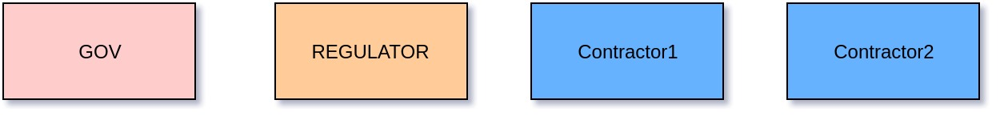
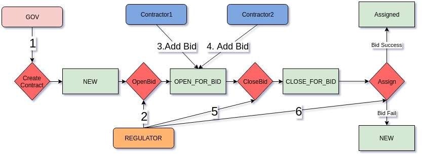

# my-bidnetwork
We often see the lack of transparency and bad practices in the bidding process due to manual intervention. Now we can implement the whole bidding process with block chain technology to improve the transparency and manual intervention to very high limit.

This POC is implemented in the blockchain framework hyperledger(1.4) which provides many good things over public block chain.

Hyperledger framework allows

1) High transaction throughput.
2) We can add the nodes based on their role and restrict their functionality according to role.
3) It allows sharing of private data between two nodes allowing confidentiality between the two organization.

I have used above characteristics of the hyperledger to implement the this POC.

# Use Case Scenario Overview: Bidding for Goverment Contract

This use case shows how bidding process for government contract can be implemented using blockchain. In this use cases we have four organization which are participating in the bid network each on of having its specific role.

1) GOV: GOV will add the contract in the blockchain having the information as contractID, bidStartDate, bidEndDate, description, minimumBid. For this contract GOV is seeking highest bidder.
2) REGULATOR: This participant will act as regulator for bidding process. All the newly created blocks will be distributed from this node.
3) Contractor1,Contractor2: These participants will bid for the government contract added by the GOV.
All the bidding events will be captured on the blockchain with consensus mechanism so that information will be trusted by each participants. Details of the whole process is as follows.

To implement the bidding process on blockchain, we can convert contract to be bid as entity and deploy it on blockchain. Then we can tack the lifestyle of the contract in transparent non correctable way. In each stage of the contract lifecycle, smart contract(chaincode) can perform the different action. Following contract lifecycle is implemented for this POC

# Contract Lifecycle:

Following are the stages in the contract lifcycle deployed in blockchain. All the movement in the contract lifcycle is based on the business rules implemented chaincode.

1) NEW: This is the state when new contract is created by the GOV organization. This is the initial stage of contract and can be used to propagate the information to the different contractor about the contract details. Initiater for this stage is GOV
2) OPEN_FOR_BID: After the initial cooling period, the contract is open for bid. At this stage different contractors are can bid for the contract.  Chaincode will validate the incoming bid and either accept/reject bid based on business validation implemented. Initiater for this stage is REGULATOR.
3) CLOSE_FOR_BID: At this stage the contract is closed for bidding, no new bid will be accepted. Initiater for this stage is REGULATOR. 
4) Assign: At this stage contract is assigned to the highest bidder. If their are bids present for the contracts then highest bidder is selected and assigned the contract, if non of the bid is present then contract will move BID_FAIL stage.

# Testing and Running the Application

Following are the steps to run the bidnetwork application.

Basic setup is required to run this hyperledger application. The basic setup and can implemented using follwing link.

https://hyperledger-fabric.readthedocs.io/en/release-1.4/build_network.html 

Once the basic network is running, you can run the follwing steps to run the bidnetwork.

Move to the root folder my-bidnetwork and execute the following steps.

1) Generate the crypto material for all the participants using following command.

                                 *./generateartifact.sh*
                                 

